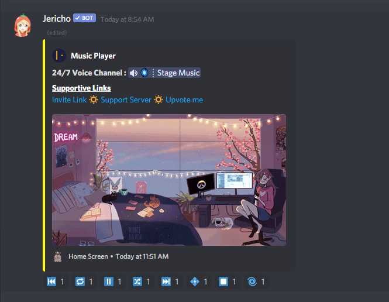

# Entertainment

## 🎶 24/7 Music Player

Jericho will Sing many `Songs/Playlists` from Youtube or Spotify with ease and Stage Channel is also Supported with it .



```text
dc!music play <Song/Playlist - Name/Link>
```



```
dc!music <stop> <force/Blank>
```



```
dc!music skip <position/blank> <force/blank>
```



```
dc!music search <Song-Name>
```



```
dc!music fav <blank/queue>
```



```
dc!music fav play <Song ID/all>
```




**Position means the Track Number at Queue and can be found by -** **`dc!music queue`**



### 💫 Music Player \(Without logging Feature\)

💨 This section is very simple if you just want to play a `single song or a playlist`.   
💨 It plays music from YouTube with the support of links from `Spotify , YouTube and SoundCloud.`

### 💫 Music Player \(With logging Feature\)

💨 This section is for those people who want to go more into enjoying the music without the effort to write the prefix again and again. Simply set up once and sit back and enjoy your favorite tracks. 


_**Note:-** The channel which has the logging feature will play or try to play everything entered in that channel \(**excluding commands**\)_




```text
dc!music setup
```

The setup process is quite simple.  
Just type the **above command** and hit Enter.  
Join a **Voice Channel** where you want the Jericho to be **`24/7 Active`**. After Joining the Voice Channel , Write `Done` and It will be Saved . After that , For Setting up **Logger Channel** \( **`Music Player U.I.`** \) , Mention a Text Channel like - **`<#Channel-Name>`** where you want to set up the logging feature.





```text
dc!music edit <Voice/Channel>
```

**Here,  
Voice - `Voice Channel`  
Channel - `Music Logger Channel (Music Player U.I.)`**

**After that Jericho will ask for `New Voice/Music-logger-Channel` for the Server.**



```text
dc!music delete <Voice/Channel/all>
```

**Here,  
Voice - `Voice Channel`  
Channel - `Music Logger Channel (Music Player U.I.)`   
all - `Delete All Configs for the Server`**

**After that Jericho will Delete for `New Voice/Music-logger-Channel` for the Server.**



