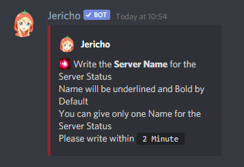

# Utilities

### 📺 260+ Game server status

> #### _You can Setup Game Server Status for 260+ Games . A maximum  of 50 statuses can be made for a Server and can be deleted  and modified  anytime._

```text
dc!status setup
```




**Jericho will ask certain questions, which are to be directly answered as text no prefix is required.**



**260+ Games are Supported like Minecraft , Rust , Fivem , Halo , C.S G.O. , Valheim , e.t.c And for Minecraft with Two Types of Server Version is** _`Minecraft Java`_ **and** _`Minecraft Bedrock .`_ **And You can Games Supported by using Command - `dc!status games`**_`.`_


### 📢 Announcement Creator

### ✏️ Suggestion Logger

### 🤖 ModMail

### 😀 Reaction Roles

