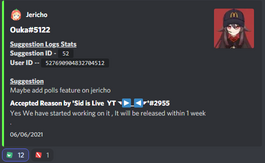
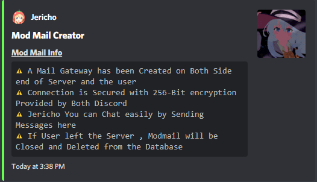
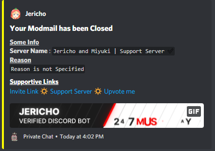

# Utilities

### 📺 260+ Game server status

> _You can Setup Game Server Status for 260+ Games .  
> A maximum  of 50 statuses can be made for a Server and can be deleted  and modified  anytime._


**`<Slot-Number>` present on Footer of the Game Server Status .**




```text
dc!status setup
```



**Jericho will ask certain questions, which are to be directly answered as text no prefix is required.**




```
dc!status edit <Slot-Number>
```





```
dc!status delete <Slot-Number/all>
```





```
dc!status <On/OFF> <Slot-Number/all>
```





```text
dc!status <hide/unhide> <Slot-Number/all>
```






**260+ Games are Supported like -** _****Minecraft , Rust , Fivem , Halo , C.S G.O. , Valheim , e.t.c_.  **And for Minecraft with Two Types of Server Version is** _**`Minecraft Java`**_ **and** _**`Minecraft Bedrock`**`.`_ **And You can See Games List Supported by Jericho , using Command -** _**`dc!status games`**`.`_



**More Commands can be Found at  -**_**`dc!status help`**_


### 📢 Announcement Creator

> _Jerich0 can send Announcements , Updates , Reports in the way of embed . You can even Customize your Way of Announcing and Even Select which Role to Ping for it . Jericho is a very Powerful and a Ultimate Tool when its time for Announcing something fancy Topic ._


_You can Announce Anything But If you Post anything Related to **`NSFW`** ,_ **`Jericho and her Staff's are not Responsible`** _for it ._ 




```text
dc!announce setup
```



### ✏️ Suggestion Logger



> _Jericho can submit your suggestions that u like to suggest for your server and make your server better , you can also reply the suggestions to give the suggester a legit answer and u can vote with `yes` or `no` for others opinions that is it good or bad for your server._


_You can Suggest Anything But If you Suggest anything Related to **`NSFW`** ,_ **`Jericho and her Staff's are not Responsible`** _for it ._


### 🤖 Mod-Mail

#### 🛡 Server Commands



```text
dc!modmail <Server ID>
```





```text
dc!modmail delete
```



```
dc!modmail edit
```



```

```



```text
dc!modmail close <reason/Blank>
```





#### 👨✈ User Commands

### 😀 Reaction Roles

