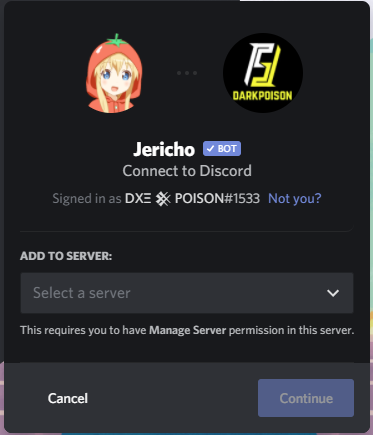

# Unable to Invite ?

### I Just about to add Jericho Why can't I see my server in the list!

### Check Your Account - is that correct ?

Many people use alternate accounts for Discord , so check twice whether the account you'r logged into is correct.  


You can click the `Not you?` text to log out of the current account.


### Do you have the correct permissions to add a bot to your desired server ?

Once you have ensured the account you are logged into is correct and is in the desired server.  
Check for permissions - To add a bot you need `MANAGE SERVER` permissions or you can have `ADMINISTRATOR` which overrides all other permissions. 

> Server owners have all the permission in their server.


Quick Tip 🎈  
If you can change the name of your server you have the required permissions.


### Still unable to Add Jericho 🙁

#### Try the steps below.

1. Try clearing the cache of your browser or some other browser. This can be done by `Ctrl + Shift + R` in Chorme browser.
2. Try Private/Incognito mode.
3. Check whether your Discord account is verified or not. 

## Issue still not fixed ?

Have a look at [Discord Status Page ](https://discordstatus.com/)for any outages.  
Or you may join the [Support Server](https://discord.gg/V5M92k4zhN) to check if there is something going on. 

